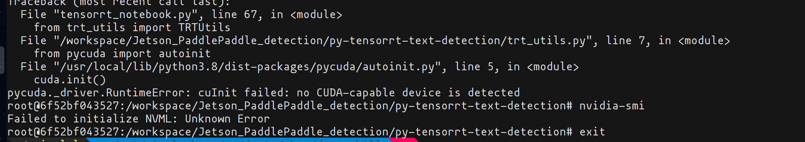

# Python TensorRT inference example

- [Python TensorRT inference example](#python-tensorrt-inference-example)
  - [Pre-requisite](#pre-requisite)
  - [Tested OS Environment](#tested-os-environment)
  - [Development Environment](#development-environment)
    - [Install TensorRT](#install-tensorrt)
      - [Method 1: Native Install](#method-1-native-install)
      - [Method 2 (Recommended): Use tensorRT container](#method-2-recommended-use-tensorrt-container)
    - [Install Dependencies](#install-dependencies)
  - [Model Conversion (ONNX to TensorRT)](#model-conversion-onnx-to-tensorrt)
    - [Method 1: Using `polygraphy` or `trexec`](#method-1-using-polygraphy-or-trexec)
    - [Method 2: Using tensorRT libraries (see utility file `trt_utils.py`)](#method-2-using-tensorrt-libraries-see-utility-file-trt_utilspy)
  - [Related Files for this folder](#related-files-for-this-folder)
  - [Tips and Questions When Running TensorRT](#tips-and-questions-when-running-tensorrt)

## Pre-requisite
- You MUST have Nvidia GPU on your device, regardless you are using a physical computer or a virtual machine.
- Make sure you have cuDNN (matches your cuda version) and cuda installed (check nvcc --version)

## Tested OS Environment
- We tested the code on
    - Desktop or VM using Ubuntu 20.10 (with tools installed of version Ubuntu 20.04 version since 20.10 is not officially supported) and Ubuntu 18.04 OS.
    - Jetson Nano device.

- We *did not* test on
    - Windows OS
    - MacOS

- Using WSL (Windows Subsystem Linux) is NOT RECOMMENDED. You may run into unknown error messages.

## Development Environment
### Install TensorRT
#### Method 1: Native Install
Based on the [installation guide](https://docs.nvidia.com/deeplearning/tensorrt/install-guide/index.html#installing-pip), we can install tensorRT using pip
alone. 
1. (If you are working on conda virtual environment), follow steps in 
    [this page](https://github.com/stan-dev/pystan/issues/294).
1. Install pycuda using pip, version < 2021.1 
1. Pip install tensorR (change the tensorR version to the expected one, suggest no earlier than 7.0 version)
    ```bash
    python3 -m pip install --upgrade setuptools pip
    python3 -m pip install nvidia-pyindex
    python3 -m pip install --upgrade nvidia-tensorrt
    ```
    If you are using a requirements.txt to install tensorR package, plase make sure `--extra-index-url https://pypi.ngc.nvidia.com` is added to your requirements.txt file.

#### Method 2 (Recommended): Use [tensorRT container](https://catalog.ngc.nvidia.com/orgs/nvidia/containers/tensorrt)
1. Install Nvidia docker tool chain, following the guide [on this page](https://github.com/NVIDIA/libnvidia-container)
1. You may run into Nvidia docker problems, check if this [link](https://github.com/NVIDIA/nvidia-docker/issues/1447) helps or this [link](https://bbs.archlinux.org/viewtopic.php?id=266915)
1. (MUST) Please run the following command before installing opencv python packages:
```bash
apt-get update
apt-get install ffmpeg libsm6 libxext6  -y
```
### Install Dependencies
Run the following command:
```
pip install -r ../requirements.txt
pip install -r requirements.txt
```
## Model Conversion (ONNX to TensorRT)

*We don't provide sample for INT8 conversion, you need to provide a calibration file, please follow the official guidelines.*
### Method 1: Using `polygraphy` or `trexec`
This requires trexec being compiled and installed on the system (check [TensorRT git repo](https://github.com/NVIDIA/TensorRT/tree/main/samples/trtexec) for installation guide), 
or if you are using TensorRT container, it is included.

```bash
polygraphy convert dynamic_identity.onnx -o dynamic_identity.engine \
    --trt-min-shapes X:[1,3,28,28] --trt-opt-shapes X:[1,3,28,28] --trt-max-shapes X:[1,3,28,28] \
```
After converting, you can inspect the converted engine with polygraphy to make sure the converted engine is correct. Note that, please set the min, opt and max shape correspondingly based on your application scenario.

### Method 2: Using tensorRT libraries (see utility file `trt_utils.py`)
We only demonstrate the conversion using python API, in the function `_build_engine_onnx(self) -> trt.tensorrt.ICudaEngine`.

## Related Files for this folder
The following files are required to run the `tensorrt_notebook.ipynb` notebook.
Please refer to the parent level readme for details of each file.

```bash
├── model_common
│   ├── __init__.py
│   ├── paddle_decoder.py
│   ├── paddle_operators.py
│   ├── paddle_preprocess.py
│   └── utils.py
├── models
│   └── ch_PP-OCRv2_det_infer.onnx
├── py-tensorrt-text-detection
│   ├── README.md
│   ├── requirements.txt
│   ├── tensorrt_notebook.ipynb
│   └── trt_utils.py
├── requirements.txt
└── sample_images
    └── nutrition_label.jpg
```
- `trt_utils.py` is the python script showing how to convert an onnx model to tensorRT engine using python API and then run single inference using the converted tensorRT engine. Note that, the onnx to tensorRT engine conversion is tailored to paddlepaddle text detection model,  PLEASE MODIFY IT ACCORDINGLY BASED ON YOUR MODEL.
- `tensorrt_notebook.ipynb` is a python notebook that demostrates the model conversion and inference process using tensorRT engine and PaddlePaddle text detection model.


## Tips and Questions When Running TensorRT

- Make sure you only get *one* execution context per engine.
- Make sure your onnx model is "dynamic" (value is `-1` in the dynamic dimension ) if you want to convert to a tensorRT engine with dynamic input.
- Make sure your image input size falls into the min, max profile you specified when converting to a tensorRT engine.
- When you modify the `trt_utils.py`, make sure you only run `self._trt_engine.create_execution_context()` ONCE. DO NOT create multiple execution context for one tensorRT engine.
- When running docker container for a while, you may encounter an error message as follow, and restart the container can solve the problem.
 
 
